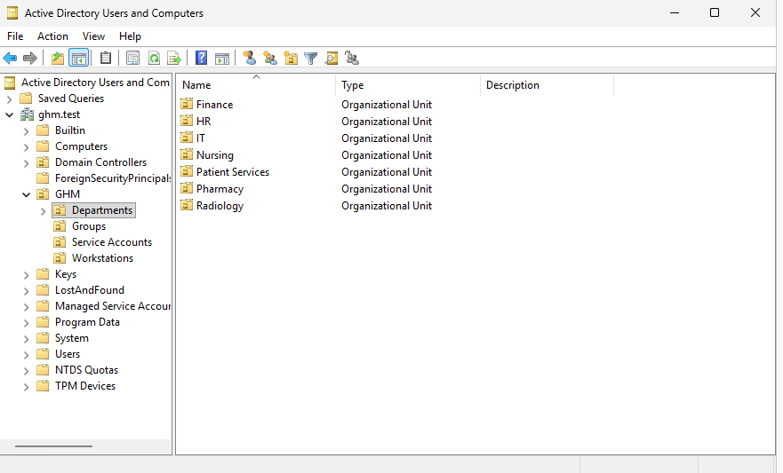
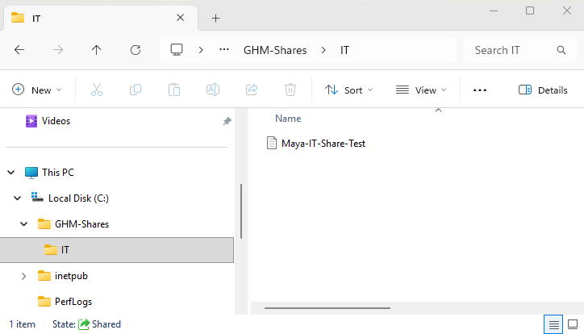
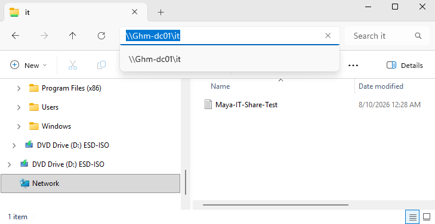
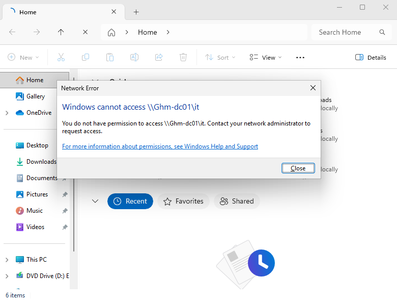
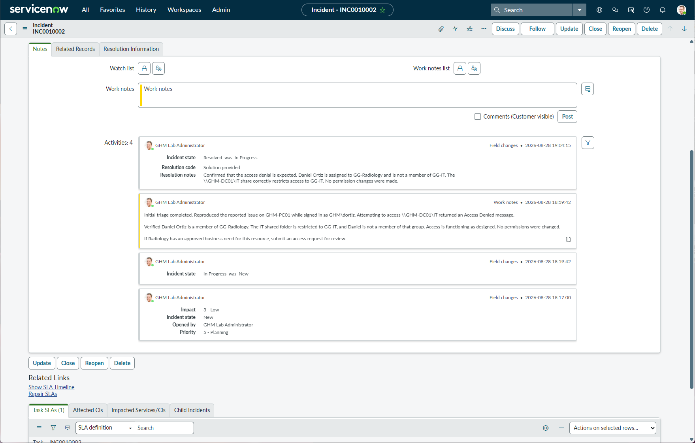
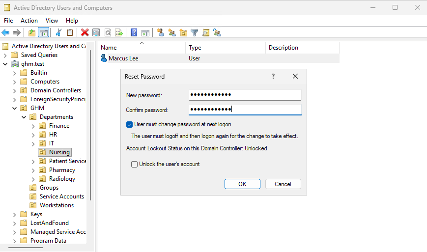
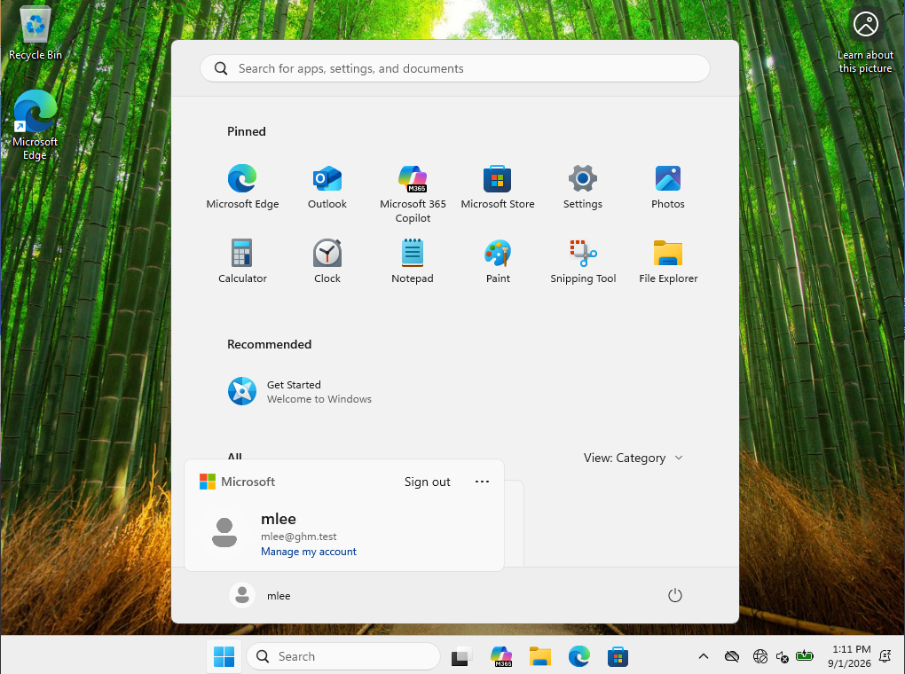
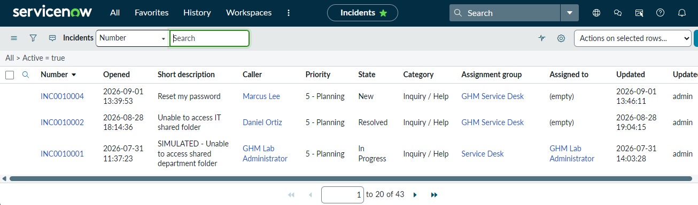
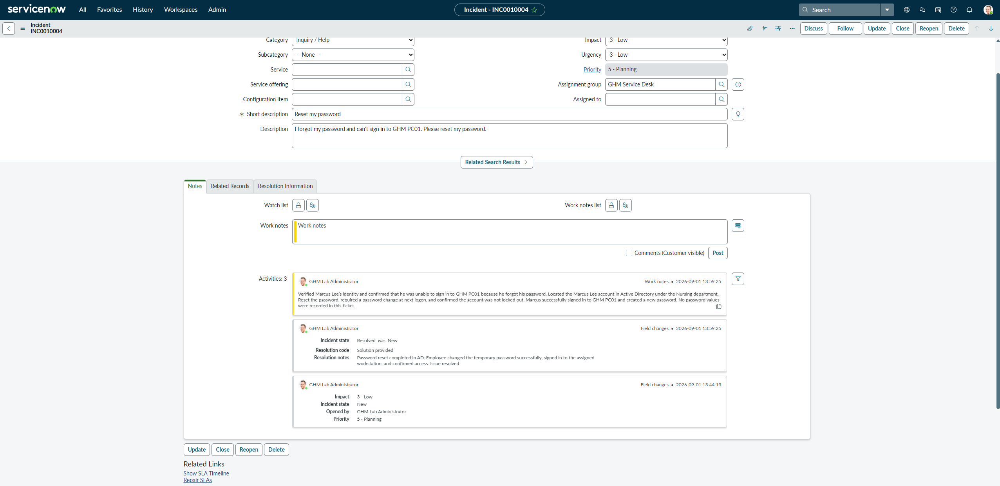

# Gold Harbor Medical — Hospital Help Desk Home Lab

## About This Lab

Gold Harbor Medical is a fictional hospital IT environment I built as a home lab to practice support tasks in a hands-on way.

I am using this project to learn how Active Directory, Windows workstations, shared-folder permissions, and ticket documentation fit together in a basic Help Desk workflow. It is a work in progress, and I plan to add new scenarios as I learn.

> All organization names, users, systems, and scenarios in this project are fictional. Screenshots are sanitized before being shared.

## Environment

- Hyper-V virtual machines
- Windows Server 2025 domain controller: `GHM-DC01`
- Windows 11 workstation: `GHM-PC01`
- Active Directory domain: `ghm.test`
- Active Directory Users and Computers
- Department organizational units and security groups
- Group-based shared-folder access
- ServiceNow Personal Developer Instance

## What I Have Practiced

- Configuring a Windows Server domain controller and DNS
- Creating organizational units for hospital departments
- Creating users and department security groups
- Joining a Windows workstation to the domain
- Organizing workstations in Active Directory
- Creating and testing a restricted IT shared folder
- Verifying both authorized and denied access
- Creating, documenting, and resolving a ServiceNow incident
- Sanitizing technical screenshots for documentation

## Completed Scenario: Restricted IT Share

The IT shared folder is restricted to members of the `GG-IT` security group.

- Maya Chen is a member of `GG-IT` and can access `\\GHM-DC01\IT`.
- Daniel Ortiz is a member of `GG-Radiology` and receives an Access Denied message when attempting to access the same share.
- The expected denial was verified through Active Directory group membership and documented in ServiceNow.

## Selected Screenshots

### Department OU Structure

### IT Shared Folder

### Access Verification

Maya Chen, a member of `GG-IT`, can access the IT share.

Daniel Ortiz is not a member of `GG-IT`, so access is correctly denied.

### Ticket Resolution

## Ticket Example

**INC0010002 — Unable to access IT shared folder**

Daniel Ortiz reported that he could not access the IT shared folder. The issue was reproduced from the domain workstation, and his group membership was reviewed.

The investigation confirmed that Daniel belongs to `GG-Radiology`, while the IT share is restricted to `GG-IT`. No permission changes were made because access was functioning as designed. The incident was documented with internal work notes and resolved.

## Documentation

This repository includes sanitized screenshots showing:

- Domain controller and Active Directory setup
- Department OU and security-group structure
- Domain user and workstation verification
- IT-share creation and access testing
- ServiceNow investigation notes and resolution

### Password Reset Scenario

Marcus Lee reported that he could not sign in because he forgot his password. I reset the account in Active Directory, required a password change at next logon, and verified that Marcus could sign in successfully. The request was documented and resolved in ServiceNow.

#### Password Reset in Active Directory

#### Successful Login

#### ServiceNow Assignment

#### ServiceNow Resolution

## Next Steps

- Add more Help Desk ticket scenarios
- Practice password resets, account lockouts, and group-access requests
- Add documented troubleshooting procedures
- Continue improving the lab as I learn
