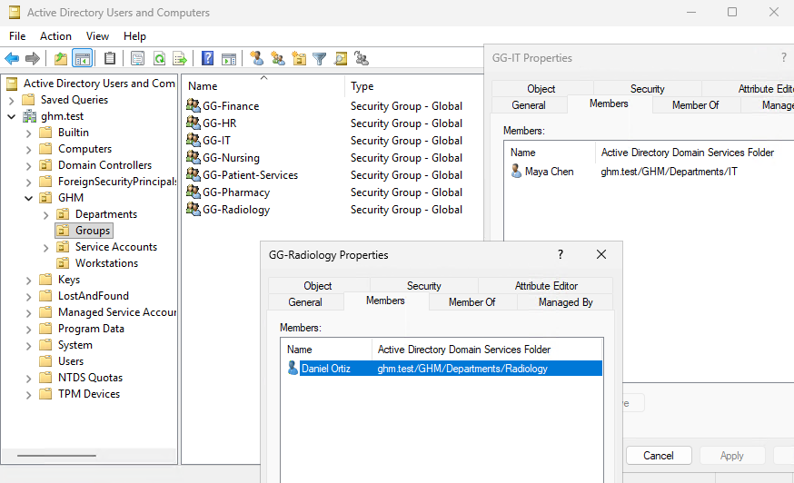
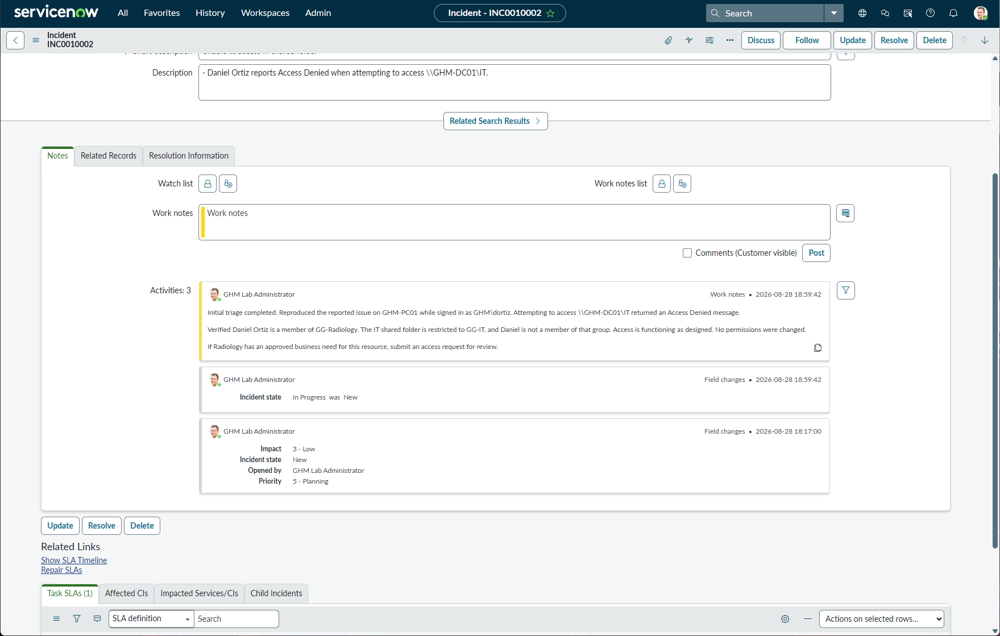

# Ticket 01 — Restricted IT Share

## Ticket

**INC0010002 — Unable to access IT shared folder**

Daniel Ortiz reported that he could not access the IT shared folder.

## Investigation

The issue was reproduced from the domain workstation, and Daniel’s Active Directory group membership was reviewed.

Daniel belongs to `GG-Radiology`, while the IT share is restricted to members of `GG-IT`.

## Resolution

No permission changes were made because access was functioning as designed. Maya Chen, a member of `GG-IT`, successfully accessed the share. Daniel Ortiz received Access Denied as expected.

The investigation was documented with internal work notes, and the ServiceNow incident was resolved.

## Evidence

### Department OU Structure

### IT Shared Folder

### Maya Authorized Access

### Daniel Access Denied

### Group Membership Verification

### ServiceNow Investigation Notes

### ServiceNow Resolution

