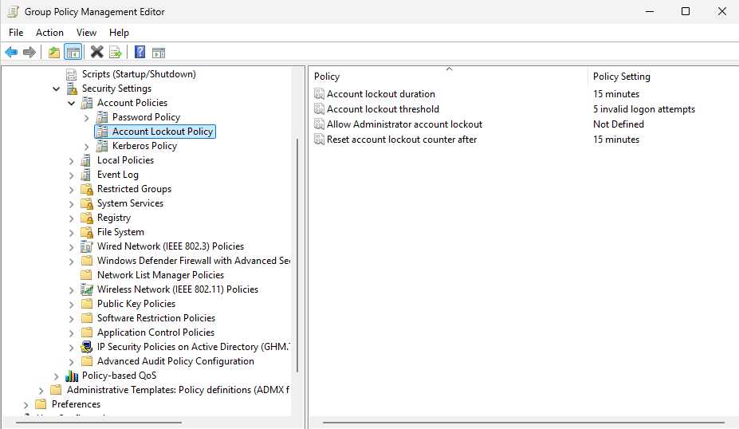
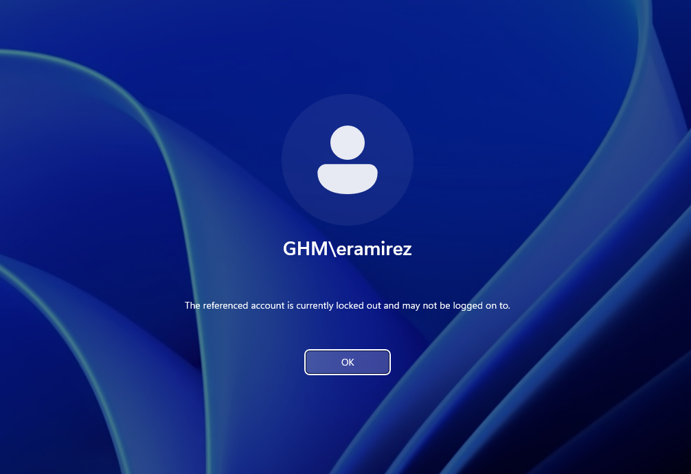
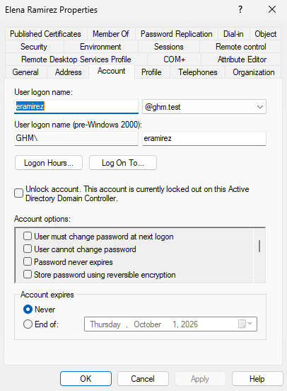
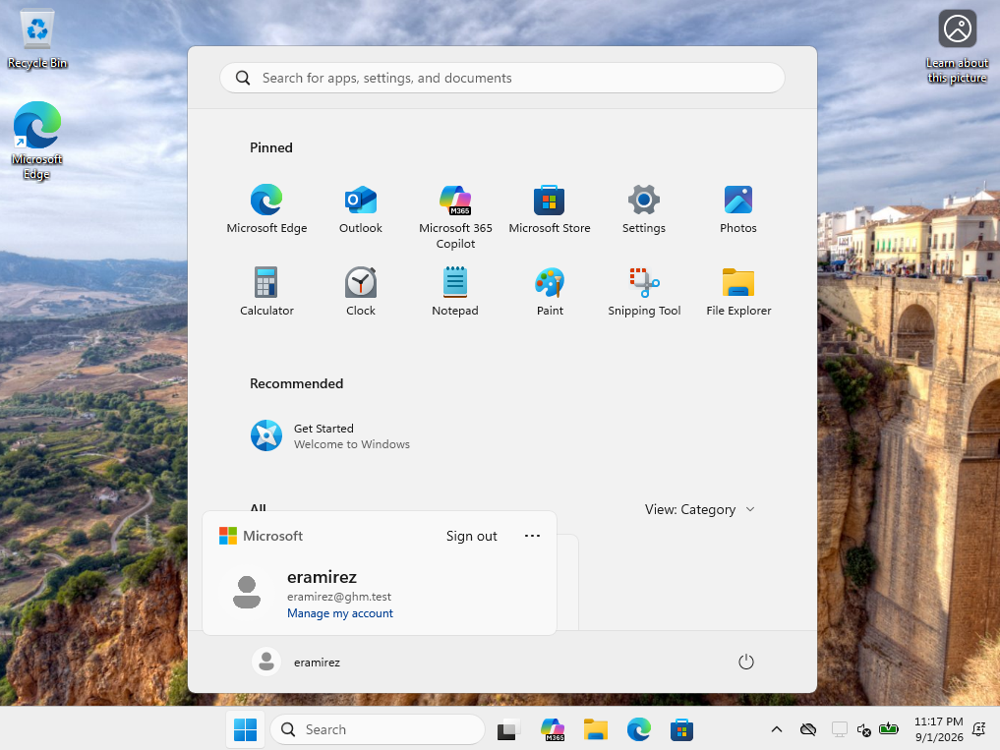
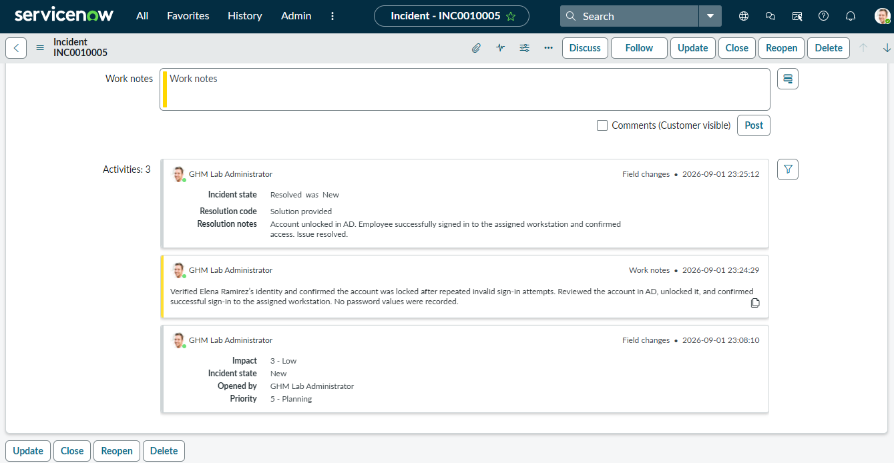

# Ticket 03 — Account Lockout

## Ticket

**INC0010005 — Account locked**

Elena Ramirez reported that she could not sign in to `GHM-PC01` because her account was locked.

## Investigation

The domain Account Lockout Policy was reviewed before testing. The lab policy was configured for five invalid logon attempts, with a 15-minute lockout duration and a 15-minute counter-reset period.

A controlled test confirmed that Elena’s account became locked after repeated invalid sign-in attempts.

## Resolution

Elena’s account was reviewed in Active Directory and unlocked by an administrator.

Elena then successfully signed in to `GHM-PC01` using her correct password. The incident was documented and resolved in ServiceNow.

## Evidence

### Account Lockout Policy

### Locked Account Message

### Locked Account in Active Directory

### Successful Workstation Login

### ServiceNow Resolution

