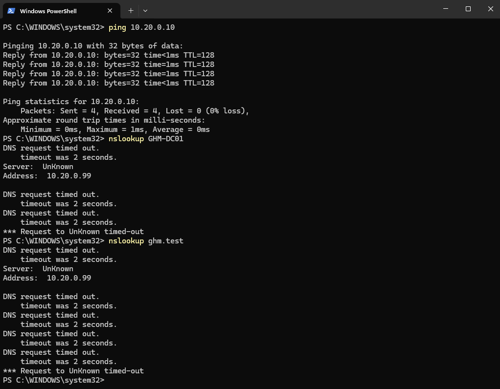
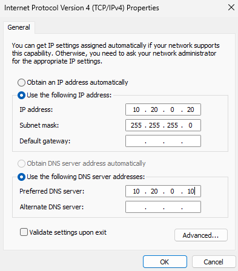
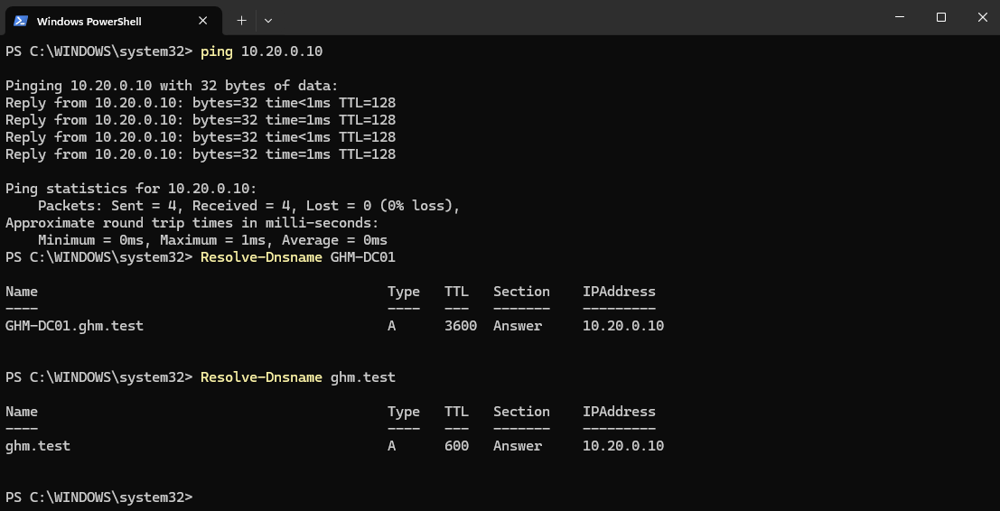
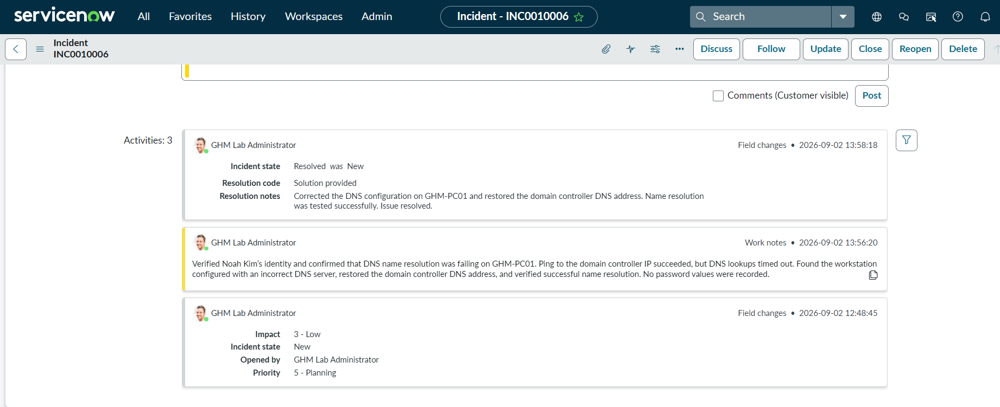

# Ticket 04 — DNS Resolution

## Ticket

**INC0010006 — DNS is not resolving**

Noah Kim reported that he could not reach internal resources or websites by name from `GHM-PC01`.

## Investigation

Basic connectivity to the domain controller was tested first. PC01 could successfully reach `10.20.0.10` by IP address, but DNS name resolution failed.

The workstation’s IPv4 configuration was then reviewed. PC01 was using the incorrect DNS server address `10.20.0.99` instead of the domain controller DNS server at `10.20.0.10`.

## Resolution

The DNS configuration on `GHM-PC01` was corrected to use `10.20.0.10`.

Connectivity and name resolution were tested again. `GHM-DC01.ghm.test` and `ghm.test` resolved successfully.

The incident was documented and resolved in ServiceNow.

## Evidence

### DNS Resolution Failure

### Incorrect DNS Configuration

### Corrected DNS Configuration

### DNS Resolution Restored

### ServiceNow Resolution

