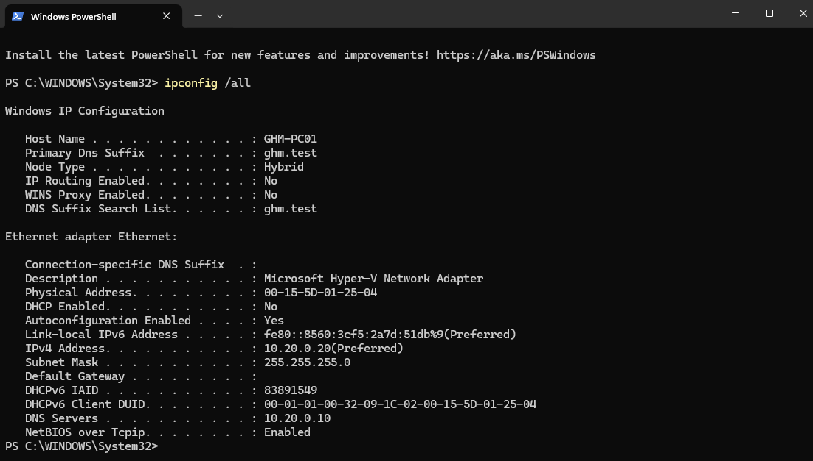
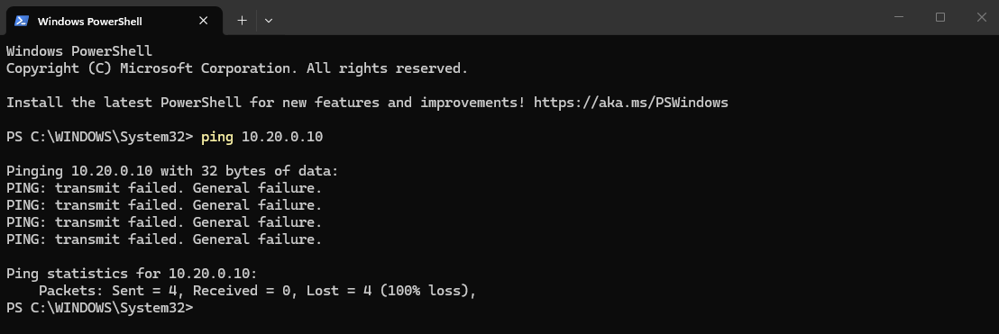
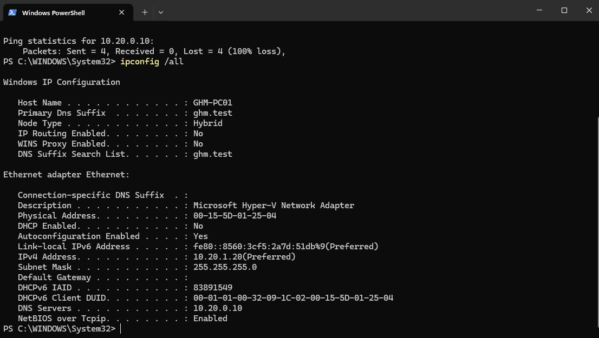
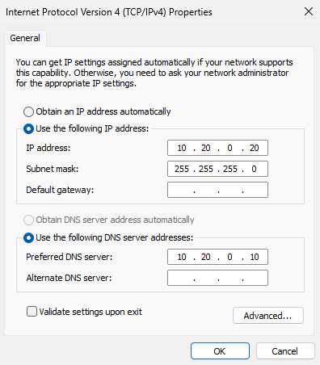
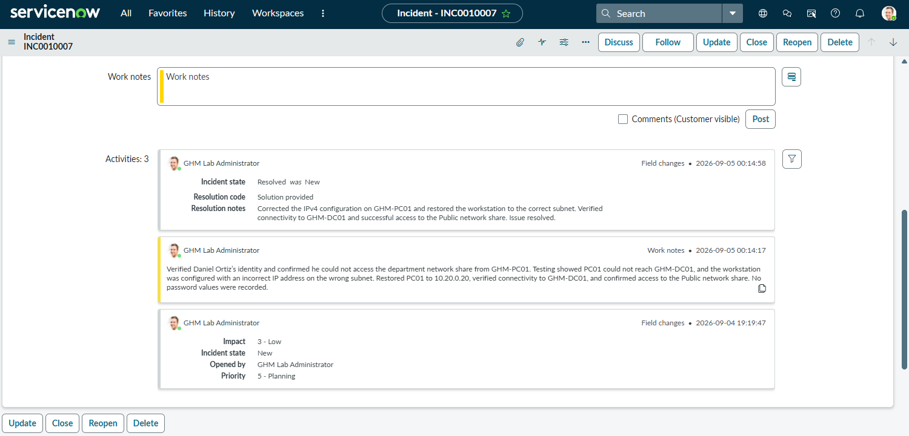

# Ticket 05 — Workstation Network Connectivity

## Ticket

**INC0010007 — Cannot connect to network**

Daniel Ortiz reported that he could not access the department network share from `GHM-PC01`.

## Investigation

The Public network share was confirmed to be available from the domain environment. PC01 was then tested from Daniel’s session.

The workstation could not reach the domain controller at `10.20.0.10`. Further review showed that PC01 was configured with the incorrect IPv4 address `10.20.1.20`, placing it on the wrong subnet. The correct workstation address is `10.20.0.20`.

## Resolution

The IPv4 configuration on `GHM-PC01` was restored to `10.20.0.20`. Connectivity to `GHM-DC01` was verified, and Daniel successfully accessed the Public network share at `\\GHM-DC01\Public`.

The incident was documented and resolved in ServiceNow.

## Evidence

### Baseline Network Configuration

### Connectivity Failure

### Incorrect IP Configuration

### Corrected IP Configuration

### ServiceNow Resolution

