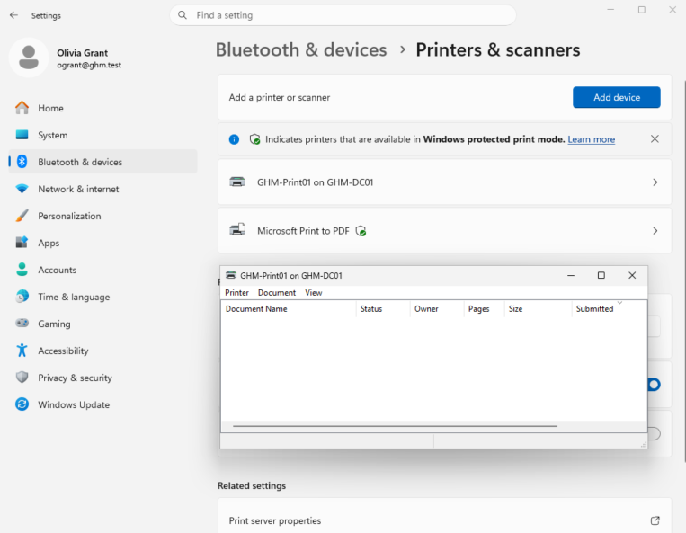
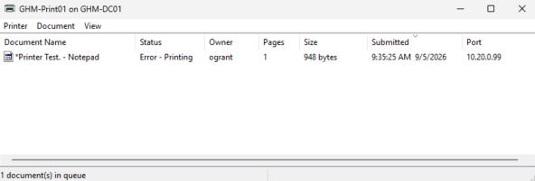
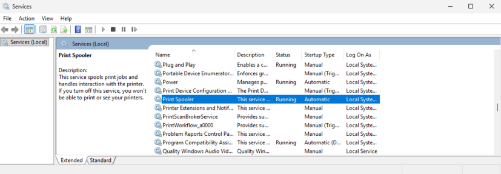
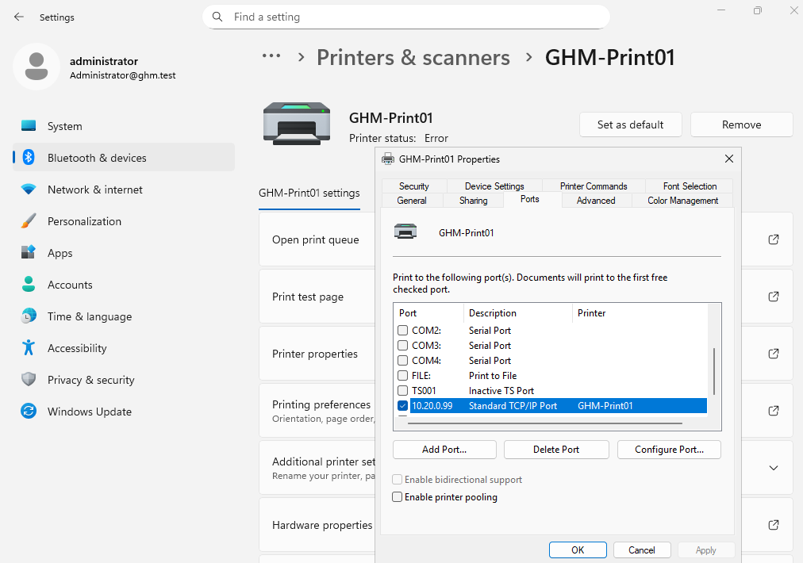
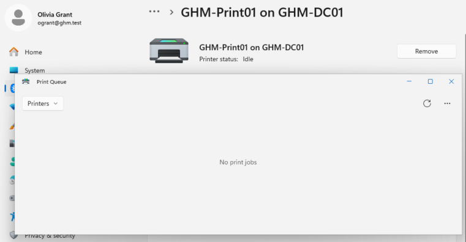
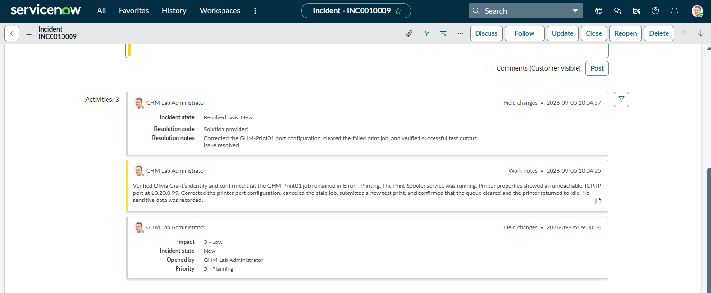

# Ticket 06 — Printer Troubleshooting

## Ticket

**INC0010009 — Unable to print**

Olivia Grant reported that she was unable to print a document from her workstation. The printer appeared unavailable and the print job did not complete.

## Investigation

The shared printer `GHM-Print01` was confirmed on Olivia’s workstation. A test document was submitted and remained in the print queue before changing to an error state.

The Print Spooler service was checked and confirmed to be running. Printer properties showed that `GHM-Print01` was configured with an unreachable TCP/IP port.

## Resolution

The printer port configuration was corrected, the failed print job was cleared, and a new test print was submitted successfully. The queue returned to an idle state.

The incident was documented and resolved in ServiceNow.

## Evidence

### Printer Queue Baseline

### Print Error

### Print Spooler Status

### Unreachable Printer Port

### Cleared Print Queue

### ServiceNow Resolution

