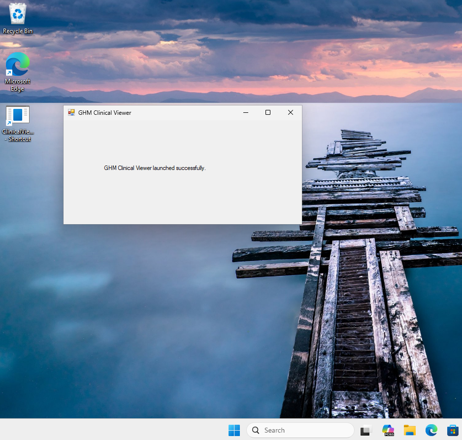
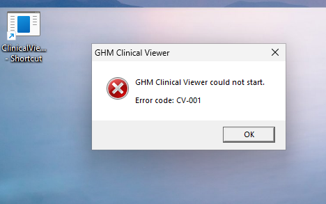
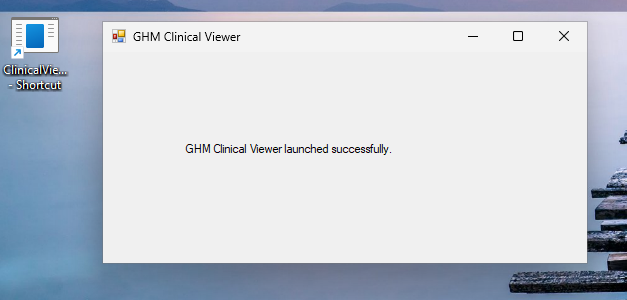
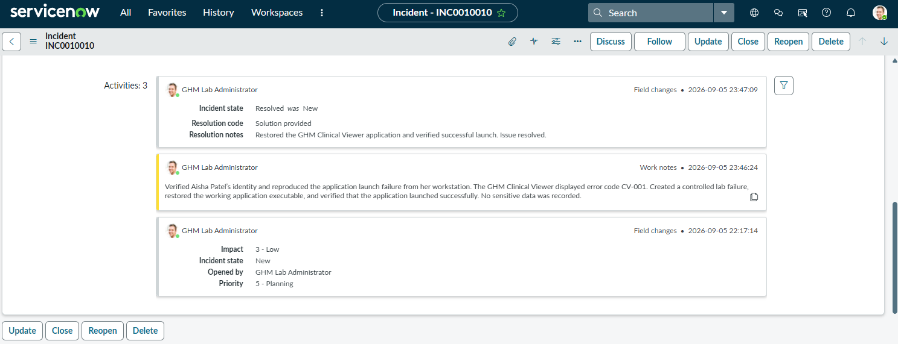

# Ticket 07 — Application Will Not Open

**Incident:** INC0010010  
**Caller:** Aisha Patel  
**Category:** Inquiry / Help  
**Assignment group:** GHM Service Desk  
**Status:** Resolved

## User-Reported Issue

Aisha Patel reported that the GHM Clinical Viewer application would not open from her workstation. She clicked the desktop shortcut, but the application displayed an error and did not start normally.

## Troubleshooting Workflow

1. Confirmed the application launched successfully before troubleshooting.
2. Reproduced the reported failure from Aisha’s workstation.
3. Verified that the issue was isolated to the application launch.
4. Used a controlled lab failure build to simulate the unavailable application condition.
5. Restored the working application executable.
6. Relaunched the application and verified successful operation.
7. Documented the resolution in ServiceNow.

## Evidence

### Baseline Application Launch

### Application Launch Failure

### Application Restored

### ServiceNow Resolution

## Resolution

A separate failure build was used to safely reproduce the application error in the lab. The working GHM Clinical Viewer executable was restored, and the application launched successfully afterward.

The incident was documented and resolved in ServiceNow.
