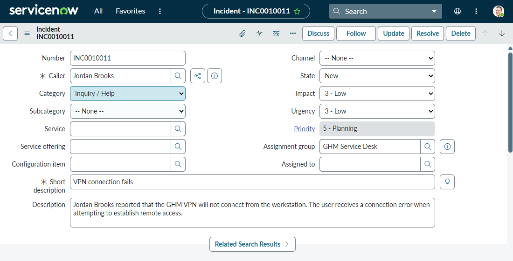
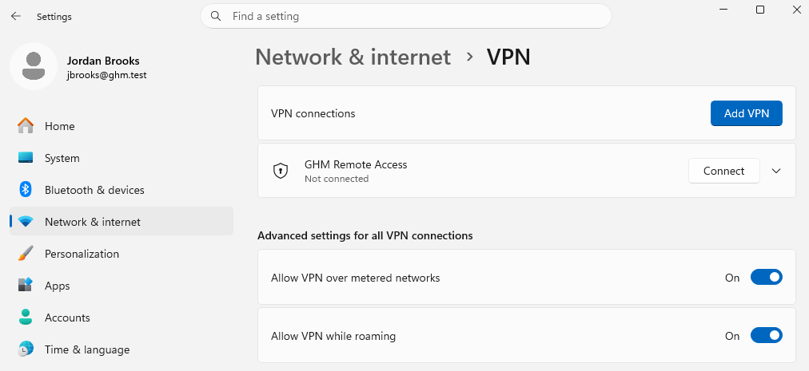
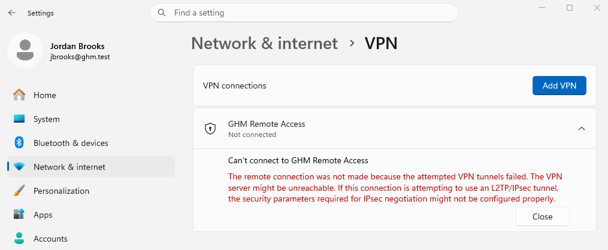
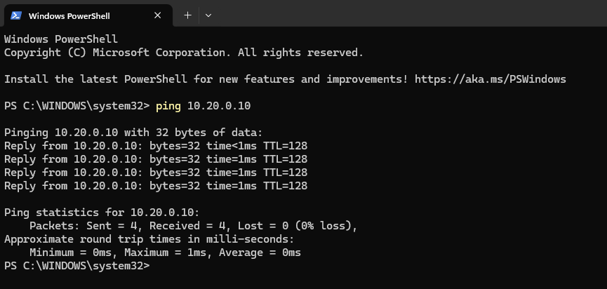
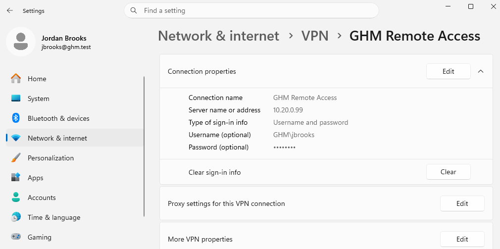
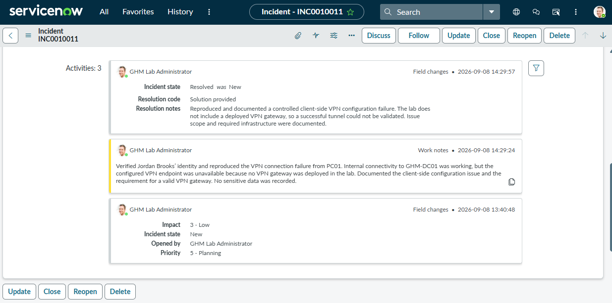

# Ticket 08 — VPN Connection Failure

Incident: `INC0010011`  
Caller: Jordan Brooks  
Category: Inquiry / Help  
Assignment group: GHM Service Desk  
Status: Resolved  

## User-Reported Issue

Jordan Brooks reported that the GHM VPN would not connect from PC01. Windows displayed a connection error when attempting to establish remote access.

## Troubleshooting Workflow

1. Verified Jordan Brooks’ identity and workstation access.
2. Created the GHM Remote Access VPN profile on PC01.
3. Attempted the VPN connection and reproduced the failure.
4. Verified PC01 could reach GHM-DC01 internally.
5. Reviewed the VPN profile configuration.
6. Determined that the configured VPN endpoint was unavailable.
7. Documented the limitation in ServiceNow.

## Evidence

### Ticket Created

### VPN Profile Created

### VPN Connection Failure

### Internal DC01 Connectivity Check

### VPN Profile Configuration

### ServiceNow Resolution

## Resolution

The VPN failure was reproduced as a controlled client-side configuration issue. PC01 could reach GHM-DC01 internally, but the configured VPN endpoint `10.20.0.99` was unavailable because the lab did not include a deployed VPN gateway.

The issue scope and infrastructure requirement were documented in ServiceNow. A successful VPN tunnel was not claimed because no VPN gateway was configured in the lab.

> This is a controlled home-lab simulation and is not being presented as production VPN administration experience.
